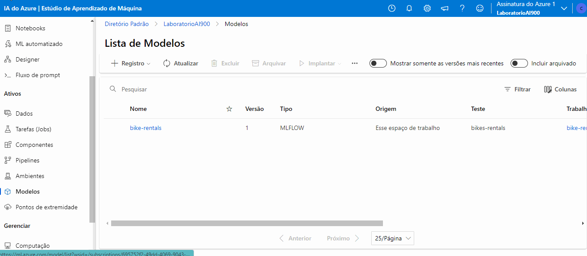
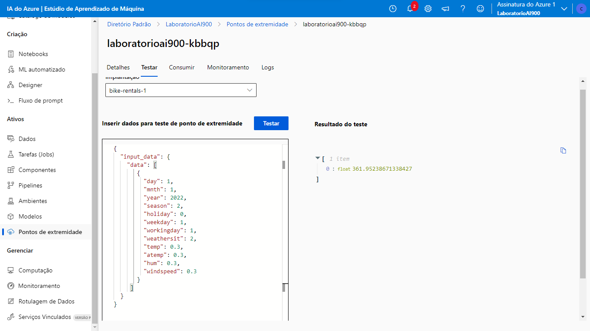

# Azure Machine Learning - 00
## Criando um passo a passo do Desafio proposto nas aulas de certificação AI-900.

#### *O metodo e fonte de dados usados nesse passo a passo estão referenciados ao [final deste documento](#final)*.

 

### 01 - Acessando recurso do Azure Machine Learning

Após as devidas configurações da sua conta no Azure, (*Configure seu primeiro acesso no Azure gratuitamente [clicando aqui](https://azure.microsoft.com/pt-br/free/)*), o proximo passo é criar um recurso de Machine Learning.

Para iniciar, clique na opção "Criar um recurso", em seguida pesquise por **Azure Machine Learning**, em seguida é só clicar sobre o icone para criar o recurso.

 

### 02 - Configurando o Azure Machine Learning

No painel intitulado "*Noções Básicas*", na seção "*Detalhes do Recurso*", foi inserida a assinatura correspondente à cobrança no campo designado como "*Assinatura*". Posteriormente, foi especificado o "*Grupo de Recursos*" que irá incorporar o recurso a ser criado.

Em seguida, na seção "*Detalhes da Área de Trabalho*", foram fornecidos os detalhes do espaço de trabalho a ser estabelecido. 

Considerando que o contexto era de um laboratório, as configurações aplicadas foram mínimas. Finalmente, o recurso foi criado ao selecionar a opção "*Consultar + Criar*". Após a aprovação da validação, clique em "*Criar*".

 

Uma vez que o recurso foi estabelecido, proceda clicando no botão intitulado "*Ir para o Recurso*", o que irá direcionar à página correspondente ao recurso em questão.

Nesta interface, note a presença do botão denominado "*Iniciar o Estúdio*", cuja função é redirecionar-lo para o estúdio do **Azure Machine Learning**. Como ilustrado na imagem abaixo:

 

### 03 - Acessando o estúdio do Azure ML

Uma vez dentro do *estúdio Azure ML*, clique na opção denominada "ML Automatizado" localizada no menu à esquerda. Já na página subsequente que se abriu, clique na opção "Novo Trabalho de ML Automatizado". Como mostra o vídeo abaixo:

Na seção "Configurações Básicas", preencha os campos "Nome do Trabalho", "Novo Nome do Experimento" e "Descrição". Posteriormente, clique no botão "Avançar".

Em seguida, na opção "Tipo de Tarefa e Dados", selecione a tarefa do tipo "Regressão". Após isso, ao selecionar "Selecionar Dados", clique no botão "Criar". Na janela que se abriu, na seção "Tipos de Dados", preencha os campos "Nome", "Descrição" e o "Tipo" definindo-o como Tabular. Em seguida clique em "Avançar".

Ja no passo subsequente "Fonte de Dados", escolha a opção "De Arquivos da Web" e novamente clique no botão "Avançar".

No passo "URL da Web", informe a URL https://aka.ms/bike-rentals correspondente ao conjunto de dados. No passo "Configurações", preencha as configurações do conjunto e ao avançar na opção "Esquema", e verifique os tipos de dados. Finalmente, ao clicar em "Avançar", verifique as configurações criadas para o ativo de dados e em seguida clique no botão "Criar".

Na seção "Configurações de Tarefas", selecione o conjunto de dados previamente importado. Posteriormente, na opção "Coluna de Destino", designe a coluna "rentals" como alvo.

Na seção "Limite", foram inseridos os valores conforme indicado na imagem abaixo. Após ative a opção "Habilitar Encerramento Antecipado".

Já na página "Validar e testar", na opção "Tipo de validação", escolha "Divisão de validação de treinamento".

Ao avançar, já na parte de "Computação", mantenha os valores informados na imagem abaixo:

Agora clique em "Avançar" e examinar as configurações do trabalho, clique em "Enviar trabalho de treinamento".

Ao finalizar o trabalho de treinamento, o modelo ficará disponível na opção do menu esquerdo "Modelos".

 

### 04 - Analisando as Métricas do modelo

Para acessar as métricas do modelo treinado, vá até a página do modelo e acesse o link disponibilizado com o nome do trabalho criado. Como mostra o vídeo a seguir:

 

### 05 - Testando o modelo

No menu a esquerda, clique em "Pontos de extremidade" e selecione o ponto correspondente ao modelo gerado. Em seguida acesse a aba "Testar".

Para esse teste foi utilizado o json abaixo:

<code>
{
  "input_data": {
    "data": [
       {
         "day": 1,
         "mnth": 1,   
         "year": 2022,
         "season": 2,
         "holiday": 0,
         "weekday": 1,
         "workingday": 1,
         "weathersit": 2, 
         "temp": 0.3, 
         "atemp": 0.3,
         "hum": 0.3,
         "windspeed": 0.3 
       }
     ]
  }
}

</code>

 

A previsão resultante do modelo foi estabelecida como: 361.95, como mostra o print abaixo:

 

### *Referências*:

- Explore Automated Machine Learning in Azure Machine Learning - [*Microsoft Learn*](https://microsoftlearning.github.io/mslearn-ai-fundamentals/Instructions/Labs/01-machine-learning.html)

- [Fonte de dados](https://raw.githubusercontent.com/MicrosoftLearning/mslearn-ai-fundamentals/main/data/ml/daily-bike-share.csv)
